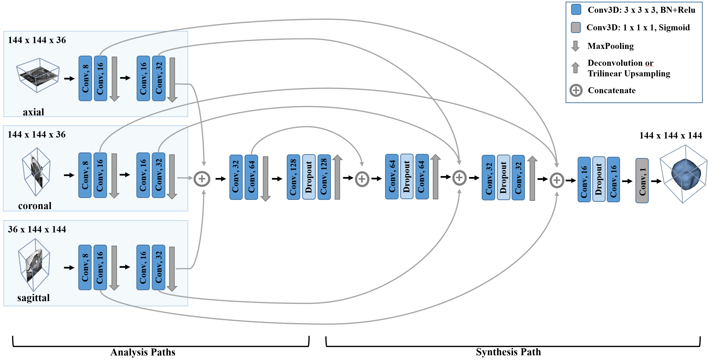

# AnisotropicMultiStreamCNN
[](https://opensource.org/licenses/MIT)

Source code of the paper "Anisotropic 3D Multi-Stream CNN for Accurate Prostate Segmentation from Multi-Planar MRI".



## Setup
```
pip install -r requirements.txt
```

## Inference

### Usage
```
Usage: inference.py [-h] {single,dual,triple} model_dir image_dir output

Inference.

positional arguments:
  {single,dual,triple}  Path to the config space definition.
  model_dir             Model directory.
  image_dir             Input image directory.
  output                Output filename

optional arguments:
  -h, --help            show this help message and exit
```

### Example
```
python inference.py dual models/dual data/ProstateX-0176 output.nrrd
```

## Training

### Data structure
Data structure goes here

### Preprocessing
TODO

### Usage
```
usage: train.py [-h] [-m {SinglePlane,TriplePlane,DualPlane}]
                [--data-dir DATA_DIR] [-lr LEARNING_RATE] [-bs BATCH_SIZE]
                [-e EPOCHS] [--early-stop] [--lr-decay]
                output

Start training.

positional arguments:
  output                output directory

optional arguments:
  -h, --help            show this help message and exit
  -m {SinglePlane,TriplePlane,DualPlane}, --model-type {SinglePlane,TriplePlane,DualPlane}
  --data-dir DATA_DIR   Path to data directory.
  -lr LEARNING_RATE, --learning-rate LEARNING_RATE
                        learning rate (default 0)
  -bs BATCH_SIZE, --batch-size BATCH_SIZE
                        batch size (default 1)
  -e EPOCHS, --epochs EPOCHS
                        epoch count (default 100)
  --early-stop          use early stop
  --lr-decay            use learning rate decay
```

### Example
```
python traing.py --model-type dual --data-dir path/to/data output_dir
```

## Hyperparameter optimization

The hyperparameter optimization (HPO) uses the HpBandSter package, which combined Hyperband with Bayesian optimization.
The subsections below show how a HPO job can be started in a distributed system with n>=1 workers.

### Preparere configspace file
This python file describes the hyperparameter search space. The file must define a `get_configspace()` function
returning a `ConfigSpace` object. Take a look at `example_configspace.py`.

### Start hpo_server
This script is repsonsible for sampling configurations and scheduling jobs to hpo_workers. The output directory is used
to save trained models (for efficiency, as some of them will be reused in the course of the optimization) and to log
sampled configs. At the end of the optimization a file with the best configuration is written.

```
python hpo_server.py example_configspace.py output --iterations 3 --workers 2 --min-budget=30
--max-budget=270
```

### Start hpo_worker(s)
This script starts a worker that evaluates sampled configs received from the server.
```
python hpo_worker.py output
```